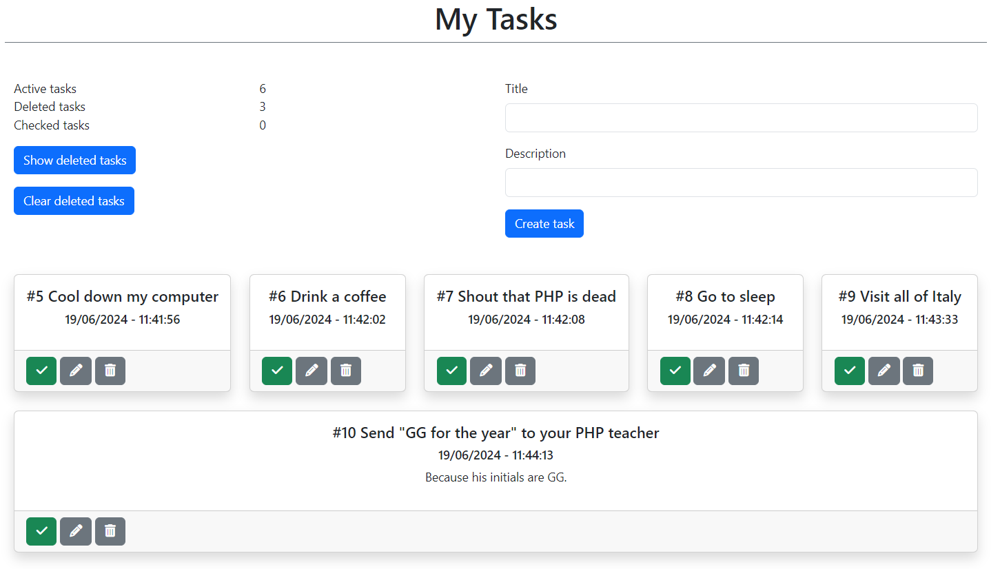

# Examen PHP 2023-2024 : Création d'une application de liste de tâches en PHP

## Objectif
Créer une application web en PHP permettant de gérer une liste de tâches (todo list) avec les fonctionnalités suivantes

## Fonctionnalités
- [x] Ajouter une tâche.
- [x] Marquer une tâche comme réalisée ou non.
- [x] Supprimer une tâche.
- [x] Éditer une tâche.
- [x] Persister les données dans un fichier CSV.

## Instructions
### Structure des fichiers
- [x] index.php: La page principale affichant la liste de tâches.
- [x] functions.php: Contient les fonctions pour gérer les tâches (ajout, suppression, modification, marquage comme réalisée/non réalisée).
- [x] add.php: Script pour ajouter une nouvelle tâche.
- [x] delete.php: Script pour supprimer une tâche.
- [x] toggle.php: Script pour marquer une tâche comme réalisée/non réalisée.
- [x] edit.php: Script pour éditer une tâche et formulaire de modification.
- [x] todos.csv: Fichier CSV pour stocker les tâches.

### Détails de la mise en œuvre
- index.php
	- [x] Affiche un formulaire pour ajouter une nouvelle tâche.
	- [x] Liste toutes les tâches avec des options pour les marquer comme réalisées/non réalisées, les éditer et les supprimer.
- functions.php
	- [x] getTodos(): Lit le fichier CSV et retourne un tableau des tâches.
	- [x] saveTodos($todos): Enregistre le tableau des tâches dans le fichier
- add.php
  - [x] Ajoute une nouvelle tâche à la liste et redirige vers index.php.
- delete.php
  - [x] Supprime la tâche spécifiée de la liste et redirige vers index.php.
- toggle.php
  - [x] Marque une tâche comme réalisée/non réalisée et redirige vers index.php.
- edit.php
  - [x] Affiche un formulaire pour éditer une tâche.
  - [x] Met à jour la tâche spécifiée et redirige vers index.php.

### Remarques
• Assurez-vous que le fichier todos.csv est accessible en écriture par le serveur web.
• Utilisez des balises HTML pour styliser la page si nécessaire.
• Vous pouvez améliorer l'interface utilisateur en utilisant des frameworks CSS comme Bootstrap – Pure Css ou Miligramme